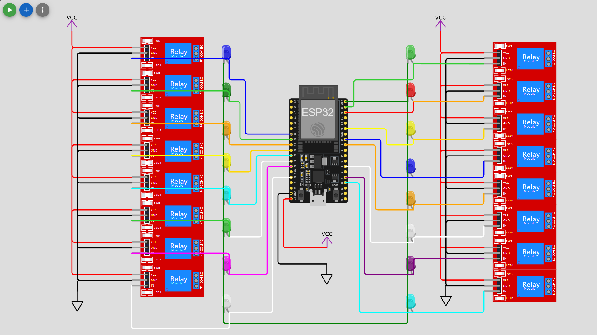
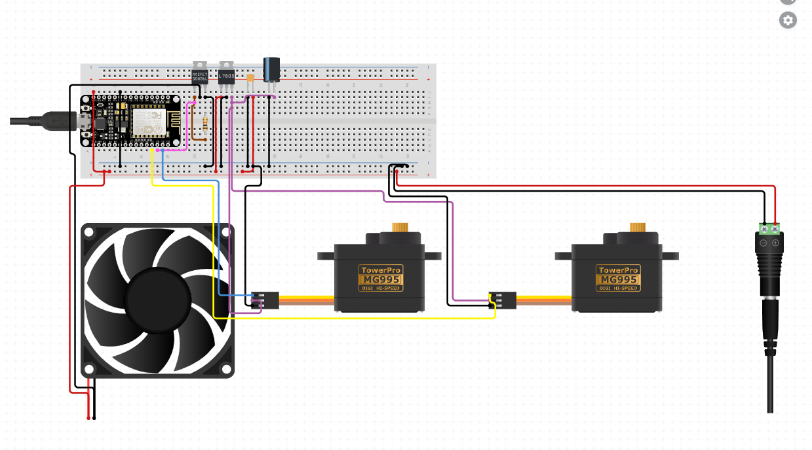

# Home Automation Using Telegram Bot and ESP32

This project demonstrates how to build a **smart home automation system** using an **ESP32 microcontroller** and a **Telegram Bot**. Users can control various devices such as lights, fans, and other appliances using a Telegram bot interface.Features include GPIO management, Wi-Fi connectivity, MQTT/HTTP protocols, real-time updates, and secure access using Telegram's API.

---

## Features

- Control up to 16 devices via Telegram bot.
- Individual ON/OFF and All ON/All OFF commands.
- Secured access using predefined chat IDs.
- Status feedback with visual symbols (✅ for ON, ☑ for OFF).

---

## Getting Started

Follow these steps to set up the project and run it on your ESP32.

### **1. Hardware Requirements**

- ESP32 Microcontroller Board
- WiFi connection
- 16 output devices (e.g., LEDs, relays for appliances)
- Breadboard and jumper wires
- USB Cable for ESP32 programming
- Power source for connected devices

---

### **2. Circuit Diagram**

Connect the output pins on the ESP32 (`13, 14, 12, ...`) to the respective devices (LEDs or relays).

#### **Example Circuit**
Insert an image of your circuit here.  
Upload your circuit diagram (e.g., from Fritzing or hand-drawn).  

```markdown

```

```markdown

```
---

### **3. Software Requirements**

- Arduino IDE (with ESP32 board support installed)
- Telegram app on your smartphone
- Git (optional for cloning this repository)

---

### **4. Installation**

#### **Step 1: Clone the Repository**
```bash
git clone https://github.com/Ganesh-Solapure/Home-Automation-Using-Telegram-Bot-ESP-32.git
cd Home-Automation-Using-Telegram-Bot-ESP-32
```

#### **Step 2: Install Libraries**

Ensure you have the following libraries installed in Arduino IDE:

- WiFi
- WiFiClientSecure
- UniversalTelegramBot

#### **Step 3: Configure Credentials**

Update the following details in the code:
```c
#define BOTtoken "Your_Telegram_Bot_Token"
char ssid[] = "Your_SSID";
char password[] = "Your_WIFI_Password";
```

#### **Step 4: Upload Code to ESP32**

1. Connect ESP32 to your computer.
2. Select the correct board and COM port in Arduino IDE.
3. Click on **Upload**.

---

### **5. Using the Telegram Bot**

1. Open Telegram and search for **BotFather** to create your bot.
2. Save the API token provided by BotFather and update it in the code.
3. Add your bot to a chat or group.
4. Use commands like `/start`, `/switch`, `/AllOn`, and `/AllShutDown` to interact with the devices.

---

## Demo

Include working images or videos here. For example:
```markdown

```

Upload GIFs/videos showing:
1. Device switching using the bot.
2. ESP32 controlling devices.

---

## Project Prototype

Include an image of your prototype setup:
```markdown

```

---

## Commands Overview

| Command        | Function                                      |
|----------------|----------------------------------------------|
| `/start`       | Displays welcome message and options         |
| `/switch`      | Opens the switchboard interface              |
| `/AllOn`       | Turns ON all connected devices               |
| `/AllShutDown` | Turns OFF all connected devices              |

---

## Troubleshooting

### **Common Issues**
1. **WiFi not connecting**: Verify SSID and password.
2. **Bot not responding**: Ensure the bot token is correct and check internet connectivity.
3. **Devices not working**: Check the wiring and power supply.

---

## Future Improvements

- Add scheduling features for device control.
- Integrate sensors (e.g., temperature, motion detection).
- Expand to support more devices.

---

## License

This project is licensed under the [Apache License 2.0](LICENSE).

---

## Author

Created by **Ganesh Solapure**  
For any queries or suggestions, reach out via GitHub.

---

## Contributions

Contributions are welcome! Feel free to submit a pull request or open an issue for improvements.

---

### **Instructions for Adding Images and Videos**

1. **Circuit Diagram**:  
   - Use tools like [Fritzing](https://fritzing.org/) to create a neat circuit diagram.
   - Save the image in the repository's `/images` folder.

2. **Working Demo**:  
   - Record a video of your setup in action (e.g., using a smartphone).
   - Convert it into a GIF using tools like [EZGIF](https://ezgif.com/video-to-gif) or save the video file.

3. **Prototype Image**:  
   - Take a clear photo of your prototype.
   - Save it as `/images/prototype.jpg` in the repository.

### **Embedding Media**
Ensure your images and videos are properly linked in the `README.md`:
- Upload images/videos to your repository (`/images` folder).
- Use relative paths in Markdown, such as:
  ```markdown
  
  ```
- For videos, upload them to platforms like YouTube and embed the link:
  ```markdown
  [](https://www.youtube.com/watch?v=example)
  ```
